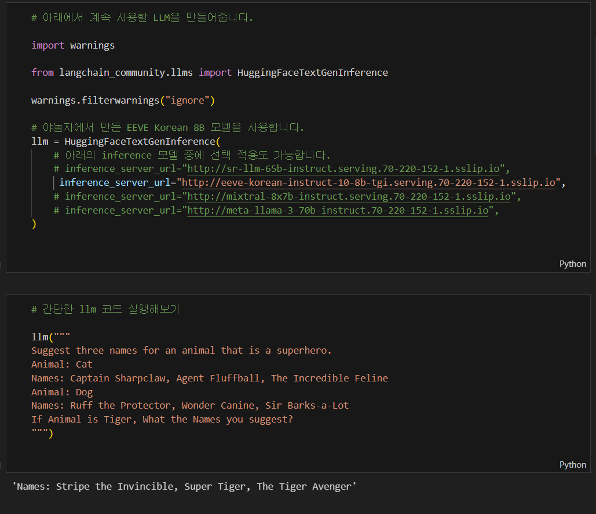
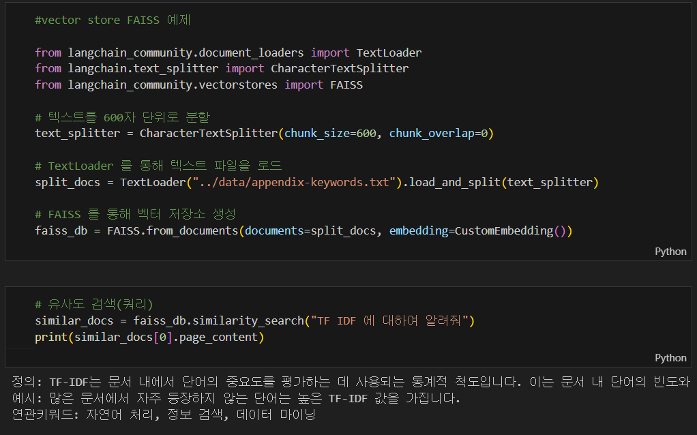
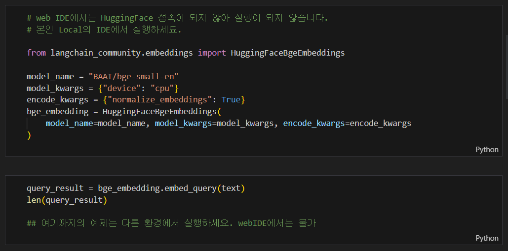

# RAG Tutorial

## RAG 플레이그라운드에 오신 여러분 환영합니다.

- RAG Playground는 사내 개발환경에서 LLM을 활용하는 역량 강화의 목적으로 만들어졌습니다.

- 사내에서 Serving 되고 있는 LLM 모델을 활용해서 RAG의 기초를 다지고, 여러가지 테스트를 해볼 수 있어요. 

- 임베딩 모델은 SDS임베딩 만을 지원하고 있습니다. 

- llm은 tgi 기반의 model.py, 임베딩은 embedding.py에서 instance를 생성해서 사용합니다. 

 

## RAG 프로그래밍 과정의 예제 코드를 제공합니다. 

rag-example에서 소개되었던 Confluence 기반으로 RAG하는 예제코드를 포함해, retriever_txt.py와 같은 여러 RAG 리트리버들에 대한 간단한 예제가 포함되어 있습니다.

"src/01. basic.ipynb"부터 "06. chain.ipynb"에는 Langchain의 기초부터 RAG와 Chain 구성에 대한 예제들을 Jupyter Notebook으로 실행 가능합니다. 

먼저 01.basic 노트북을 열어보시면, 사내에서 제공되는 여러 LLM 중에 한 개를 선택하여 간단한 프롬프트를 실행하는 예제를 볼 수 있습니다. 

> Langchain을 이용해 LLM 인스턴스를 만든 다음, 동물의 슈퍼히어로 이름을 만들어보라는 Few-shot Prompt 예제입니다.

 

04. embeddings 노트북을 열어보면, Text로더를 이용해서 텍스트 파일을 읽어들인 다음 검색하는 RAG 예제코드를 볼 수 있습니다. 물론, 이 안에는 PDF 파일을 여러 방식으로 RAG하는 코드들도 추가되어 있습니다. 

> FAISS를 벡터스토어로 사용하고, CharacterTextSplitter로 600자 단위로 분할해서 저장후 유사성 검색을 하는 예제입니다. 

 

물론 RAG플레이그라운드의 WebIDE에서 실행 가능한 코드들도 있지만, 일부 코드들은 여러분의 Local PC 환경에서만 실행 가능한 코드들도 있으니 주석과 설명을 잘 보고 사용하셔야 합니다. ( GPU 성능이 충분한 환경에서 개별 학습할 분들을 위해 코드를 넣어둔 것입니다.)

> HuggingFaceBgeEmbedding을 이용해 BAAI에서 만들 BGE-M3 오픈소스 임베딩으로 RAG를 구현할 때 사용합니다. 로컬 환경에서 충분히 실행가능한 컴퓨팅 파워를 가지고 있으시다면 도전해보세요. 

 

※ 본 Repo는 RAG 프로그래밍 교육 과정에서 제공된 코드들을 RAG플레이그라운드 WebIDE에서 동작하도록 수정한 것입니다. Langchain Update와 RAG 새로운 기법들이 나오면 지속적으로 업데이트 예정이지만, 본인이 직접 학습하면서 여러가지 추가하는 방식으로 해보시기 바랍니다. 

※ 예제 코드 중에는 테디노트 이경록님의 허락을 받아, 예제코드와 샘플파일들이 사용되었습니다. https://github.com/teddylee777 에 방문하시면 최신 LLM 관련 코드와 예제들을 보실 수 있습니다. 

 

### 주의사항
※ RAG플레이그라운드에서 실행하기 위해서는 WorkSpace를 신규로 생성하고 바로 pip install poetry, poetry env use python, poetry install 과 같이 환경설정을 하시면 안됩니다. 워크스페이스가 생성되고 IDE화면이 표시되고 나면 아래 순서대로 진행하세요. 

1) 왼쪽 Extensions의 모래시계가 사라져서 4개의 익스텐션이 설치 완료되는 것을 확인하고, 
2) 01.basic.ipynb 파일의 노트북 하나를 실행하면, ipykernel 익스텐션이 설치 활성화 됩니다. 
3) 그 다음에 https://code.sdsdev.co.kr/InnerSource/rag-example 에 설명된 poetry와 패키지를 설치하세요. 

위 순서를 지키지 않으면, ipykernel extension을 제대로 찾지 못해서, WorkSpace를 삭제후 재생성해야 합니다. 

